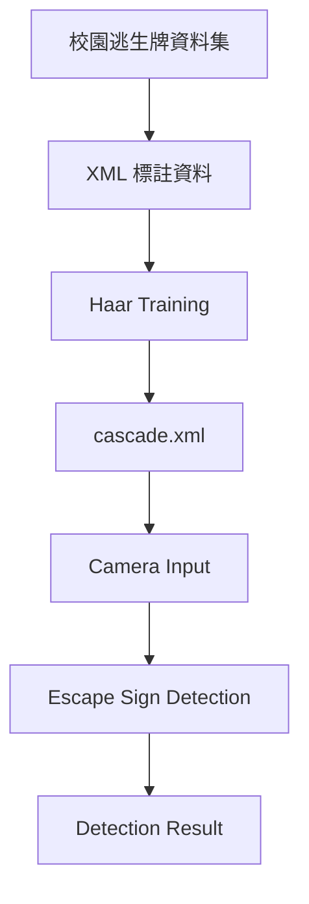

# Campus Emergency Exit Sign Detection System

校園逃生指示牌即時偵測系統，使用 OpenCV Haar Cascade 訓練逃生指示牌偵測器，並透過攝影機即時框選校園內的逃生牌。

## Project Goal

本專題目標是偵測校園中的逃生指示牌，例如：

- 綠色出口標誌
- EXIT 標誌
- 左箭頭逃生牌
- 右箭頭逃生牌
- 樓梯逃生牌

## Dataset Structure

建議資料夾結構如下：

```text
dataset/
  positive/
    img001.jpg
    img001.xml
    img002.jpg
    img002.xml
  negative/
    neg001.jpg
    neg002.jpg
```

XML 標註檔可使用 LabelImg 產生，類別名稱建議使用：

```text
escape_sign
```

## System Architecture



## Setup

安裝 Python 套件：

```powershell
pip install -r requirements.txt
```

Haar Cascade 訓練需要 OpenCV command line tools：

- `opencv_createsamples`
- `opencv_traincascade`

Windows 可安裝 OpenCV 官方 release，或使用已包含 tools 的 OpenCV build。

## Step 1: Prepare Training Files

把 LabelImg 產生的 XML 轉成 Haar 訓練需要的 positive info 檔：

```powershell
python src/prepare_haar_data.py --dataset dataset --output training
```

輸出：

```text
training/
  positives.txt
  negatives.txt
```

## Step 2: Create Vector File

執行：

```powershell
opencv_createsamples -info training/positives.txt -vec training/positives.vec -num 80 -w 48 -h 24
```

`-num` 建議小於或等於 positive 標註框數量。

## Step 3: Train Haar Cascade

PowerShell 範例：

```powershell
.\train_haar.ps1 -PositiveCount 80 -NegativeCount 120
```

訓練完成後會產生：

```text
training/cascade/cascade.xml
```

## Step 4: Camera Detection

```powershell
python src/detect_camera.py --cascade training/cascade/cascade.xml
```

按 `q` 離開視窗。

## Step 5: Image Detection

```powershell
python src/detect_image.py --cascade training/cascade/cascade.xml --image test.jpg
```

## Test Plan

| Test | Situation | Expected Result |
|---|---|---|
| 1 | 1 到 2 公尺近距離 | 成功框出逃生牌 |
| 2 | 3 到 5 公尺遠距離 | 可偵測較大的清楚標誌 |
| 3 | 正面、左斜 45 度、右斜 45 度 | 正面效果最佳，斜角仍可部分偵測 |
| 4 | 白天、晚上、室內燈光 | 光線足夠時偵測較穩定 |

## Demo Video Suggestion

展示影片約 1 分鐘即可：

```text
啟動程式
攝影機開啟
對準逃生牌
成功框選
移動鏡頭
即時追蹤
```

## Notes

Haar Cascade 對資料量、光線、角度與訓練參數很敏感。若偵測效果不穩，可嘗試：

- 增加 positive 圖片數量
- 增加不同角度與距離的樣本
- 增加 negative 背景圖片
- 調整 `detectMultiScale` 的 `scaleFactor`、`minNeighbors`、`minSize`
- 將標註框盡量貼齊逃生牌本體
